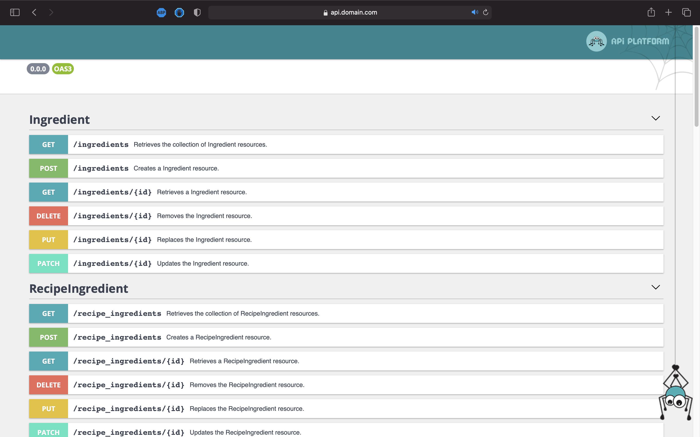

# API de recettes basé sur des outils puissants et populaires

## Technologies utilisées
* [API Platform](https://api-platform.com)
* [Lexik JWT](https://github.com/lexik/LexikJWTAuthenticationBundle)
* [Mercure](https://mercure.rocks)
* [Souin](https://github.com/darkweak/souin)
* [Symfony](https://symfony.com)
* [Vulcain](https://vulcain.rocks)

## Étapes

### Mise en place de l'authentification par jwt
Nous allons pouvoir créer notre authentification par token très facilement en nous basant sur le bundle `LexikJWTAuthenticationBundle`. Pour l'installer, rien de plus simple:
```bash
docker-compose exec php composer req jwt-auth
```

Puis il suffit de lancer cette commande suivante pour générer les clés si vous utilisez docker:
```bash
docker-compose exec php sh -c '
    set -e
    apk add openssl
    mkdir -p config/jwt
    jwt_passphrase=${JWT_PASSPHRASE:-$(grep ''^JWT_PASSPHRASE='' .env | cut -f 2 -d ''='')}
    echo "$jwt_passphrase" | openssl genpkey -out config/jwt/private.pem -pass stdin -aes256 -algorithm rsa -pkeyopt rsa_keygen_bits:4096
    echo "$jwt_passphrase" | openssl pkey -in config/jwt/private.pem -passin stdin -out config/jwt/public.pem -pubout
    setfacl -R -m u:www-data:rX -m u:"$(whoami)":rwX config/jwt
    setfacl -dR -m u:www-data:rX -m u:"$(whoami)":rwX config/jwt
'
```

Sinon il suffit de lancer cette commande directement sur votre poste:
```bash
jwt_passphrase=${JWT_PASSPHRASE:-$(grep ''^JWT_PASSPHRASE='' .env | cut -f 2 -d ''='')}
    echo "$jwt_passphrase" | openssl genpkey -out config/jwt/private.pem -pass stdin -aes256 -algorithm rsa -pkeyopt rsa_keygen_bits:4096
    echo "$jwt_passphrase" | openssl pkey -in config/jwt/private.pem -passin stdin -out config/jwt/public.pem -pubout
    setfacl -R -m u:www-data:rX -m u:"$(whoami)":rwX config/jwt
    setfacl -dR -m u:www-data:rX -m u:"$(whoami)":rwX config/jwt
```

Ensuite vous n'avez qu'à modifier le security.yaml avec l'exemple prêt à l'emploi qui suit:
```yaml
# ...
    firewalls:
        # ...
        main:
            anonymous: true
            lazy: true
            provider: app_user_provider
            json_login:
                check_path: /authentication_token
                username_path: email
                password_path: password
                success_handler: lexik_jwt_authentication.handler.authentication_success
                failure_handler: lexik_jwt_authentication.handler.authentication_failure

    access_control:
        # ...
        - { path: ^/docs, roles: IS_AUTHENTICATED_ANONYMOUSLY }
        - { path: ^/authentication_token, roles: IS_AUTHENTICATED_ANONYMOUSLY }
        - { path: ^/, roles: IS_AUTHENTICATED_FULLY }
```

Il nous faut aussi définir la route `/authentication_token` dans le `routes.yaml` comme suit:
```yaml
authentication_token:
    path: /authentication_token
    methods: ['POST']
```

### Mise en place de l'API

Tout d'abord, nous devons installer le système d'API officiel qui est API Platform. Pour se faire il faut exécuter la commande :
````bash
docker-compose exec php composer req api
````

API Platform est supporté par `maker-bundle` lors de la création d'une entité grâce au drapeau `--api-resource` ou `-a`. Cependant dans notre cas, les entités étant déjà générées nous devons ajouter manuellement l'annotation `APIResource` dans nos entités devant être exposées sans oublier le `use`.
```php
// ...

use ApiPlatform\Core\Annotation\ApiResource;
// ...

/**
 * @ApiResource()
 * ...
 */
class MyClass
```

Et voilà, c'est aussi simple que ça, nous avons maintenant toutes nos routes exposées pour interagir avec l'API. Et comme API Platform gère `OpenAPI`, nous pouvons les consulter facilement via le swagger sur la route `/api/docs` ou `/api` dans notre cas car API Platform est préfixé par `/api`. Cette valeur peut-être changé dans le fichier `config/routes/api_platform.yaml` grâce à la clé `prefix`.  


Enfin si vous ne souhaitez pas procéder à l'installation manuellement d'API Platform dans Symfony vous pouvez utiliser le dépôt officiel API Platform qui est prêt à l'emploi [ici](https://github.com/api-platform/core)

### Définition des points d'API
Pour définir nos points d'API, nous profiterons de l'annotation `APIResource`. Nous pourrons restreindre des méthodes HTTP et donc des actions sur l'API à certaines catégories utilisateurs.  
Par exemple, nous voulons qu'un utilisateur authentifié puisse créer une recette mais qu'il soit le seul à pouvoir la modifier, nous allons mettre en place cette annotation.  

L'annotation `APIResource` peut contenir les attributs `collectionOperations` et `itemOperations` ce qui va nous permettre de définir les règles de sécurités par operation (`DELETE`, `GET`, `PATCH`, `POST`, `PUT`).
De ce fait, nous pouvons définir dans l'annotation `APIResource` de notre entité `Recipe` les méthodes `post` et `put` avec une sécurité propre à chaque méthode de cette façon :

```php
/**
 * @ApiResource(
 *      collectionOperations={
 *          "post"={"security"="is_granted('IS_AUTHENTICATED_FULLY')"}
 *      },
 *      itemOperations={
 *          "put"={"security"="is_granted('ROLE_ADMIN') or user == object.author"}
 *      }
 * )
 * ...
 */
```

Par exemple notre classe `Recipe` devra exposer

| Nom                      | Méthode | Operation  | Sécurité                                                 |
|:------------------------:|:-------:|:----------:|:--------------------------------------------------------:|
| La liste                 | GET     | collection | `-`                                                      |
| La création              | POST    | collection | L'utilisateur doit être authentifié                      |
| L'objet simple           | GET     | item       | `-`                                                      |
| La mise à jour           | PUT     | item       | L'utilisateur est admin ou est le créateur de la recette |
| La mise à jour partielle | PATCH   | item       | L'utilisateur est admin ou est le créateur de la recette |
| La suppression           | DELETE  | item       | L'utilisateur est admin ou est le créateur de la recette |

On aura donc cette déclaration :
```php
/**
 * @ApiResource(
 *      collectionOperations={
 *          "get",
 *          "post"={"security"="is_granted('IS_AUTHENTICATED_FULLY')"}
 *      },
 *      itemOperations={
 *          "get",
 *          "patch"={"security"="is_granted('ROLE_ADMIN') or user == object.author"},
 *          "put"={"security"="is_granted('ROLE_ADMIN') or user == object.author"},
 *          "delete"={"security"="is_granted('ROLE_ADMIN') or user == object.author"}
 *      }
 * )
 * ...
 */
```

Maintenant on souhaite pouvoir uniquement lister les `Step`, mais que seuls les admin puissent les créer, les éditer mais sans pouvoir les supprimer. On aura donc ceci :
```php
/**
 * @ApiResource(
 *      security="is_granted('IS_AUTHENTICATED_FULLY')",
 *      collectionOperations={
 *          "get"={"security"="is_granted('IS_AUTHENTICATED_ANONYMOUSLY')"},
 *          "post",
 *      },
 *      itemOperations={
 *          "get"={
 *              "controller"=NotFoundAction::class,
 *              "read"=false,
 *              "output"=false,
 *          },
 *          "patch",
 *          "put"
 *      }
 * )
 * ...
 */
```

On remarque qu'on peut définir un security global puis redéfinir un sécurity par opération. Cela permet d'éviter la redondance. Nous voyons aussi que lorsque nous voulons retirer le `get` dans les `itemOperations` nous sommes obligés de définir la méthode comme renvoyant forcément un `NotFound` du fait qu'API Platform se base sur cette méthode pour générer les IRIs des objets. Cela ce défini donc de cette manière :
```php
 * ...
 *      itemOperations={
 *          "get"={
 *              "controller"=NotFoundAction::class,
 *              "read"=false,
 *              "output"=false,
 *          },
 *          ...
 *      }
 * ...
```
De plus il faudra forcément être authentifié dans notre cas pour requêter un item de `Step`

